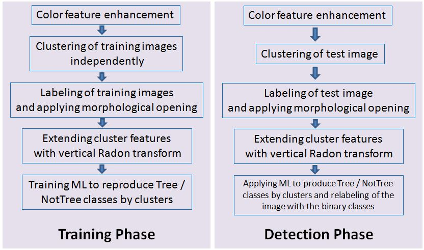

# Ressources
## Data & code
No data or code available

# Subject
## Aim
Propose a clustering based approach as a feature generation step for the segmentation of trunks in forest environnements.
This approach does not deal with shape, size or texture but **only colors**.

## Challenges
- Trees & trunks have a variety of colors, orientations, occlusions, density and the conditions of the scene (lighting, weather, seasons) affect the models.

- 3D imaging technologies already achieve good results in tree position estimation with dense point clouds, but are often heavy, pricy, computationally expensive and relying of several technologies such as Global Navigation Satellite System (GNSS).

- The appearance of the same class of objects in an image makes it difficult for the clustering alogrithm to accurately classify pixel-wise the trunks and the background.

# How
2 classes : (trunks, background) where the background is composed of {ground, leaves, sky, rocks}.

## Pre-processing on color channels
Due to variability, there isn't a all-in-one fixed method. So they infer 8 new color channels from the RGB inputs :
- $R', G', B'$
  - input RGB with 50% increased _saturation_ in the HSV color space
- $R_m, G_m, B_m = norm(R-m, G-m, B-m)$
  - input RGB with increased _contrast_ where $m=min(R,G,B)$
- $I_{max-min}=max(R,G,B)-min(R,G,B)$
  - estimation of _saturation_
- $I_{G-R}=G-R$
  - _saturation gap_ between reds and greens as they are commonly found in nature

## Clusters
On the 8 channel pixel values, a k-means clustering with k=10 is run independently on the training images of a large dataset to get 10 clusters with their centroids. This allows to  generate $10*nb_{training\ imgs}$ protoype clusters for foreground and background.

Additionnally, if a cluster belongs to tree, its vertical Radon transform will create high peaks du to the vertical nature of trunks. Therefore the highest value of Radon transform is added to each cluster resulting in **9-dimensional cluster features vector : 8 centroids + max(vertical Radon)**

## Train & test
### Data
The dataset used by the article includes images of beech, turkey oak, sessile oak, hornbeam, black alder, black locust

- Training : 13 images of size 600x800 -> 130 clusters + transfert learning on 12 other images
- Testing : 3 images manually annoted

The train data (13 + 12 images) is automatically labelled by clustering. The test data is manually annotated

### Classification
The segmentation/clustering proceeds as follows : 
1. clustering into 10 classes
2. pixel-labeling with class labels
3. morphological transformations to clean up
4. extend cluster features with highest vertical Radon transform

In cas of ambiguous belonging of a cluster to either foreground or background, the majority rule is applied.

A Logistic Model Tree is used to perform binary classification

### Results
- **Train**

Training results of the LMT (pre-trained on 13 images) on 12 new test images.

| Class      | TPR   | FPR   | F1    | MCC   |
| ---------- | ----- | ----- | ----- | ----- |
| tree       | 0.964 | 0.022 | 0.947 | 0.931 |
| background | 0.978 | 0.036 | 0.984 | 0.931 |

- **Test**

Evaluation of pixel - wise detection of trunk pixels as an average of 1.44m pixels of 3 test images.

| Class          | TPR   | FPR  | F1    | MCC  |
| -------------- | ----- | ---- | ----- | ---- |
| avg for 3 imgs | 0.869 | 0.17 | 0.693 | 0.65 |

# Critics

- The training set is very limited : the variability of the scenes is limited. The LMT model would probably have trouble classifying in different weather or lighting conditions.
- It's weird because the test data manual annotation looks oddly precise for a human carried task

# Angle count sampling (Bitterlich sampling)
[Bitterlich Method - Relaskop](https://www.youtube.com/watch?v=VggN0uWfEtQ)